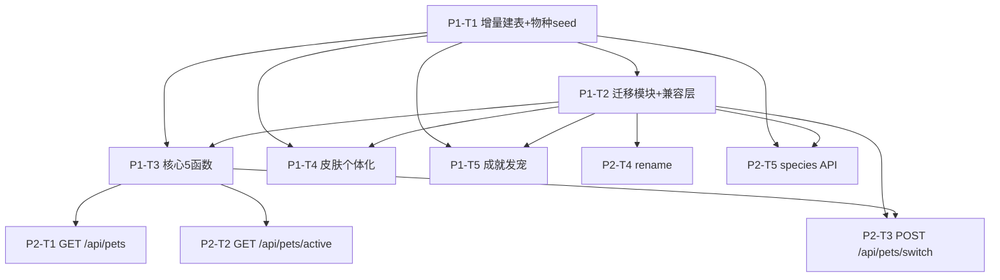

# 作业小龙 v3.3 多宠物系统 — 增量实施方案（测试库安全落地版）

> 作者：架构师 高见远（software-architect）
> 输入：`docs/multi-pet-design.md` v1.0 + 已确认决策
> 目标：**不破坏生产数据**的前提下，用最小增量改动落地多宠物后端骨架（Phase 1 + Phase 2）
> 配套文档：`docs/multi-pet-design.md`（原方案，本文件为增量落地版，并对其 BUG 修正）

---

## 0. 生产数据库铁律（最高优先级，任何代码都不得违反）

| # | 铁律 | 本方案遵守方式 |
|---|------|----------------|
| 1 | 生产库 `app/homework_pet.db` 含真实数据（`pet` 表 `name='紫宝'`，`exp=4075` 等），**严禁直接改/删现有数据** | 所有改动走 `database.py` 的 ALTER/CREATE IF NOT EXISTS，绝不 DROP/DELETE 业务数据 |
| 2 | 结构变更必须**增量**：新表 `CREATE TABLE IF NOT EXISTS`，新字段 `ALTER TABLE ADD COLUMN` | `species_catalog` / `pet_collection` 为全新表；`pet` 仅 `ALTER` 加 `active_pet_id` |
| 3 | **禁止创建全新数据库文件** | 复用现有 `homework_pet.db`，仅增表增字段 |
| 4 | 开发/测试必须复制到独立测试库，靠 `HOMEWORK_PET_DB_PATH` 指向 | 迁移与所有测试默认在 `backups/test_homework_pet.db` 跑 |
| 5 | 迁移函数必须**幂等可重跑**，且迁移前逻辑上先备份 | `migrate_single_to_multi_pet()` 用「`pet_collection` 已非空则跳过」保证幂等；运行前 `copy` 物理备份 |

> ⚠️ Phase 1 期间：**任何人不得在指向生产库的路径上执行迁移**。工程师启动服务前务必 `set HOMEWORK_PET_DB_PATH=backups/test_homework_pet.db`（Windows）或 `export`（Linux）。

---

## 1. 最终增量 DB 方案

### 1.1 `species_catalog`（物种目录表）定稿 DDL

```sql
CREATE TABLE IF NOT EXISTS species_catalog (
    id               TEXT    PRIMARY KEY,   -- 'dragon','cat','rabbit','unicorn','fox','phoenix','panda'
    name             TEXT    NOT NULL,      -- 中文名：龙/魔法猫/月光兔/九尾狐/独角兽/凤凰/熊猫
    icon             TEXT    NOT NULL,      -- emoji 占位（图片未生成时前端用）：🐲🐱🐰🦊🦄🔥🐼
    desc             TEXT,                 -- 物种简介
    base_price       INTEGER DEFAULT 0,    -- 领养售价(龙币)；0=初始宠物或仅成就专属
    rarity           TEXT    DEFAULT 'common', -- common/rare/epic/legend
    acquisition_methods TEXT,              -- 可获取途径，逗号分隔：initial,shop,gacha,achievement,signin
    stage_image_root TEXT,                 -- 静态图根目录：/static/species/{id}
    stage_count      INTEGER DEFAULT 5,    -- 进化阶段数（0=蛋 → 4=神）
    sort_order       INTEGER DEFAULT 0,    -- 展示排序
    enabled          INTEGER DEFAULT 1     -- 1=上架 0=隐藏
);
CREATE INDEX IF NOT EXISTS idx_species_catalog_enabled ON species_catalog(enabled);
```

### 1.2 `pet_collection`（宠物个体表）定稿 DDL

```sql
CREATE TABLE IF NOT EXISTS pet_collection (
    id             INTEGER PRIMARY KEY AUTOINCREMENT,
    species_id     TEXT    NOT NULL,                 -- 外键 → species_catalog.id
    skin_id        TEXT    DEFAULT 'default',        -- 该个体的皮肤（个体化，见 §5）
    name           TEXT    NOT NULL,                 -- 昵称（个体化）
    exp            INTEGER DEFAULT 0,                -- 经验（独立）
    hunger         INTEGER DEFAULT 80,               -- 饱腹（独立）
    mood           INTEGER DEFAULT 80,               -- 心情（独立）
    bond           INTEGER DEFAULT 50,               -- 亲密度（独立）
    status         TEXT    DEFAULT 'happy',          -- happy/sad/sleeping/normal
    runaway_until  DATETIME,                          -- 睡眠结束时间
    acquired_at    DATETIME DEFAULT CURRENT_TIMESTAMP,-- 获取时间
    acquisition    TEXT    DEFAULT 'initial',        -- initial/shop/achievement/gacha/signin
    is_frozen      INTEGER DEFAULT 1,                -- 1=冻结(非激活) 0=激活（冻结不衰减）
    last_decay_date DATETIME,                         -- 衰减基准（替代原 pet.last_decay_date）
    created_at     DATETIME DEFAULT CURRENT_TIMESTAMP
);
CREATE INDEX IF NOT EXISTS idx_pet_collection_species ON pet_collection(species_id);
CREATE INDEX IF NOT EXISTS idx_pet_collection_frozen ON pet_collection(is_frozen);
```

> 说明：`pet_collection` **不含 `level` 字段** —— 等级由 `exp` 派生（`calculate_evolution_stage(exp)+1`），避免冗余与不一致。
> 外键：`FOREIGN KEY (species_id) REFERENCES species_catalog(id)`（SQLite 默认开启外键检查需 `PRAGMA foreign_keys=ON`，本方案不强依赖，靠应用层保证引用完整）。

### 1.3 `pet` 表增量（仅 ALTER 一个字段，其余保留为镜像兼容层）

```sql
-- 在 init_db() 末尾以「try/except」幂等方式添加，绝不改/删现有列
ALTER TABLE pet ADD COLUMN active_pet_id INTEGER;
```

`pet` 表保留字段含义（改造后）：

| 字段 | 改造后归属 | 说明 |
|------|-----------|------|
| `coins` / `streak` / `math_streak` / `last_streak_date` / `last_math_date` / `math_challenge_today` | **全局共享**（不变） | 钱包/连续打卡/数学连续，仍在 `pet` 表 |
| `exp` / `hunger` / `mood` / `bond` / `status` / `runaway_until` / `last_decay_date` / `level` / `name` | **激活宠物的镜像** | 每次写 `pet_collection` 激活宠物后由 `sync_active_pet_mirror()` 回写，保证 50+ 处旧 `SELECT * FROM pet WHERE id=1` 不崩 |

### 1.4 `migrate_single_to_multi_pet()` 定稿实现（修正 name 继承 + 幂等）

> 修正设计文档 v1.0 §4.2 的 BUG：**第一只宠物昵称读取旧 `pet.name`（生产库为 `'紫宝'`），不再写死 `'作业小龙'`**。

```python
# 建议落点：app/multi_pet.py（新文件，纯数据层，不依赖 main.py 业务函数，避免循环 import）
import logging, shutil, os
from database import get_db_connection

logger = logging.getLogger("homework-pet.multi_pet")

# 物种目录初始数据（详见 §4）
SPECIES_CATALOG_SEED = [ ... ]   # 见 §4

def init_species_catalog(conn):
    """幂等写入物种目录（INSERT OR IGNORE，不覆盖已有）。"""
    conn.execute("""CREATE TABLE IF NOT EXISTS species_catalog (
        id TEXT PRIMARY KEY, name TEXT NOT NULL, icon TEXT NOT NULL, desc TEXT,
        base_price INTEGER DEFAULT 0, rarity TEXT DEFAULT 'common',
        acquisition_methods TEXT, stage_image_root TEXT,
        stage_count INTEGER DEFAULT 5, sort_order INTEGER DEFAULT 0, enabled INTEGER DEFAULT 1)""")
    conn.execute("CREATE INDEX IF NOT EXISTS idx_species_catalog_enabled ON species_catalog(enabled)")
    for s in SPECIES_CATALOG_SEED:
        conn.execute("""INSERT OR IGNORE INTO species_catalog
            (id,name,icon,desc,base_price,rarity,acquisition_methods,stage_image_root,sort_order)
            VALUES (?,?,?,?,?,?,?,?,?)""",
            (s['id'], s['name'], s['icon'], s.get('desc',''), s['base_price'],
             s['rarity'], s['acquisition_methods'], s['stage_image_root'], s['sort_order']))

def migrate_single_to_multi_pet(conn=None, allow_production=False):
    """幂等迁移：单宠物 → 多宠物。可重跑，已迁移则跳过。
    默认只允许在测试库跑；若指向生产库路径必须显式 allow_production=True。"""
    own = conn is None
    if conn is None:
        conn = get_db_connection()
    try:
        cur = conn.cursor()
        init_species_catalog(conn)

        # 安全网：防止误连生产库跑迁移
        db_path = conn.execute("PRAGMA database_list").fetchall()
        # get_database_url() 返回值即当前路径；生产路径需显式允许
        from database import get_database_url
        if not allow_production and get_database_url().endswith("homework_pet.db") \
           and not os.environ.get("HOMEWORK_PET_DB_PATH"):
            logger.error("[migrate] 拒绝在生产库上自动迁移！请设置 HOMEWORK_PET_DB_PATH 指向测试库。")
            return False

        # 幂等核心：pet_collection 已有数据 => 视为已迁移，跳过
        if cur.execute("SELECT COUNT(*) FROM pet_collection").fetchone()[0] > 0:
            logger.info("[migrate] pet_collection 非空，跳过（幂等）")
            _ensure_active_pointer(cur, conn)
            return True

        old = cur.execute("SELECT * FROM pet WHERE id=1").fetchone()
        if not old:
            logger.info("[migrate] pet 表无数据，跳过")
            return True
        old = dict(old)

        # ★ 关键修正：继承真实昵称，不再写死 '作业小龙'
        old_name   = old.get('name') or '作业小龙'
        old_exp    = old.get('exp', 0)
        old_hunger = old.get('hunger', 80)
        old_mood   = old.get('mood', 80)
        old_bond   = old.get('bond', 50)
        old_status = old.get('status', 'happy')
        old_runaway = old.get('runaway_until')
        old_decay  = old.get('last_decay_date')
        old_created = old.get('created_at')

        # 读取旧皮肤（current_skin，仅作用于龙）
        skin_id = 'default'
        cs = cur.execute("SELECT value FROM parent_settings WHERE key='current_skin'").fetchone()
        if cs and cs['value']:
            skin_id = cs['value']

        # 创建第一只宠物（dragon），继承旧数据；is_frozen=0 表示激活
        cur.execute("""
            INSERT INTO pet_collection
                (species_id, skin_id, name, exp, hunger, mood, bond, status, runaway_until,
                 acquired_at, acquisition, is_frozen, last_decay_date)
            VALUES ('dragon', ?, ?, ?, ?, ?, ?, ?, ?, ?, 'initial', 0, ?)
        """, (skin_id, old_name, old_exp, old_hunger, old_mood, old_bond, old_status,
              old_runaway, old_created, old_decay))
        new_pet_id = cur.lastrowid

        # 给 pet 表加 active_pet_id（幂等 try/except）
        try:
            cur.execute("ALTER TABLE pet ADD COLUMN active_pet_id INTEGER")
        except Exception:
            pass

        cur.execute("UPDATE pet SET active_pet_id = ? WHERE id = 1", (new_pet_id,))

        # 顺手修复生产库 level 异常（exp=4075 却 level=8650）：重算为派生值
        new_level = 1 + (old_exp >= 800) + (old_exp >= 2000) + (old_exp >= 4000) + (old_exp >= 8000)
        cur.execute("UPDATE pet SET level = ? WHERE id = 1", (new_level,))

        conn.commit()
        logger.info(f"[migrate] 迁移完成：首只宠物 id={new_pet_id} name='{old_name}' level={new_level}")
        return True
    except Exception as e:
        conn.rollback()
        logger.exception(f"[migrate] 迁移失败: {e}")
        return False
    finally:
        if own:
            conn.close()

def _ensure_active_pointer(cur, conn):
    """确保 pet.active_pet_id 指向一只真实存在的宠物（兜底）。"""
    row = cur.execute("SELECT active_pet_id FROM pet WHERE id=1").fetchone()
    aid = row['active_pet_id'] if row else None
    if aid and cur.execute("SELECT 1 FROM pet_collection WHERE id=?", (aid,)).fetchone():
        return
    first = cur.execute("SELECT id FROM pet_collection ORDER BY id LIMIT 1").fetchone()
    if first:
        cur.execute("UPDATE pet SET active_pet_id=? WHERE id=1", (first['id'],))
        conn.commit()
```

**迁移前备份（调用方责任 / 推荐封装）：**
```python
def backup_before_migrate(src_path, backup_dir="backups"):
    os.makedirs(backup_dir, exist_ok=True)
    ts = get_current_time().strftime("%Y%m%d_%H%M%S")
    dst = os.path.join(backup_dir, f"homework_pet_pre_multi_{ts}.db")
    shutil.copy2(src_path, dst)
    logger.info(f"[migrate] 已备份 {src_path} -> {dst}")
    return dst
```

### 1.5 `sync_active_pet_mirror()` 兼容层逻辑

> 作用：把**激活宠物**的个体属性回写到 `pet` 表的镜像字段，使所有 `SELECT * FROM pet WHERE id=1` 的旧代码继续正确工作。任何写 `pet_collection` 激活宠物的函数，提交前都应调用它。

```python
def get_active_pet_id(conn):
    """取当前激活宠物 id（pet_collection.id）。单一事实来源，禁止在业务代码里硬编码 id=1 取个体属性。"""
    row = conn.execute("SELECT active_pet_id FROM pet WHERE id=1").fetchone()
    aid = row['active_pet_id'] if row else None
    if aid and conn.execute("SELECT 1 FROM pet_collection WHERE id=?", (aid,)).fetchone():
        return aid
    # 兜底：pet_collection 中唯一未冻结的宠物
    r = conn.execute("SELECT id FROM pet_collection WHERE is_frozen=0 LIMIT 1").fetchone()
    return r['id'] if r else None

def sync_active_pet_mirror(conn):
    """激活宠物 → pet 表镜像字段（exp/hunger/mood/bond/status/runaway_until/level/name）。"""
    row = conn.execute("SELECT active_pet_id FROM pet WHERE id=1").fetchone()
    active_id = row['active_pet_id'] if row else None
    if not active_id:
        return
    a = conn.execute(
        "SELECT name, exp, hunger, mood, bond, status, runaway_until FROM pet_collection WHERE id=?",
        (active_id,)).fetchone()
    if not a:
        return
    a = dict(a)
    # level 由 exp 派生（修正 8650 异常）
    level = 1 + (a['exp'] >= 800) + (a['exp'] >= 2000) + (a['exp'] >= 4000) + (a['exp'] >= 8000)
    conn.execute("""
        UPDATE pet SET name=?, exp=?, hunger=?, mood=?, bond=?, status=?, runaway_until=?, level=?
        WHERE id=1
    """, (a['name'], a['exp'], a['hunger'], a['mood'], a['bond'],
          a['status'], a['runaway_until'], level))
```

### 1.6 启动钩子（仅在测试库 / 显式允许时跑迁移）

```python
# 在 main.py 启动处（import 后、路由前）调用，但默认不在生产库自动跑：
def ensure_multi_pet_ready():
    """幂等确保多宠物结构就绪；迁移本身幂等，重复调用无副作用。"""
    from multi_pet import migrate_single_to_multi_pet
    # 默认行为：仅在设置了 HOMEWORK_PET_DB_PATH（即测试库）时自动迁移
    if os.environ.get("HOMEWORK_PET_DB_PATH"):
        migrate_single_to_multi_pet()
# ensure_multi_pet_ready()   # Phase 1 可先注释，由工程师手动在测试库触发，降低风险
```

---

## 2. 需要改造的 `main.py` 函数清单

> 「触及 WHERE id=1」列：指该函数当前是否直接写 `pet WHERE id=1`。改造后个体属性改走 `pet_collection` + `sync_active_pet_mirror()`，全局属性（coins/streak/math_streak/数学标记）仍写 `pet`。

| # | 函数 / 路由 | 当前行为 | 改造后行为 | 触及 WHERE id=1 | 改造要点 |
|---|------------|---------|-----------|----------------|---------|
| 1 | `complete_task` `/api/task/complete` | 读 `pet`(id=1)，`UPDATE pet SET exp/level/hunger/mood/streak/...` | 取 `active_id=get_active_pet_id(conn)`；`exp/hunger/mood/status` 写 `pet_collection`；`streak/math_streak` 仍写 `pet`（全局）；`coins` 走 `add_coins`；最后 `sync_active_pet_mirror()` | 是 → 改 | 个体/全局拆分；`bond` 不动（原逻辑也不动 bond） |
| 2 | `feed_pet` `/api/pet/feed` | 读 `pet`(id=1) 判 sleeping，写 `pet SET hunger/mood/bond` | 取激活宠物（来自 `pet_collection`），判 sleeping 写 `pet_collection`；`sync` 后 `check_achievements` 从镜像读新值 | 是 → 改 | 个体属性走 `pet_collection` |
| 3 | `pet_interact` `/api/pet/interact` | 读 `pet`(id=1)，写 `pet SET bond/mood`；记 `coin_transactions`(interact) | 取激活宠物写 `pet_collection` 的 `bond/mood`；`coin_transactions` 记互动仍全局；`sync` 后查成就 | 是 → 改 | 同上 |
| 4 | `scheduler_check` `/api/scheduler/run` | 对 `pet`(id=1) 做睡眠唤醒/21点睡眠/实时衰减 | **仅对激活宠物**（`pet_collection` 且 `is_frozen=0`）做上述；全局清理（custom_tasks 过期、encourage 清理、`math_challenge_today` 重置）仍在 `pet`；末尾 `sync` | 是 → 改 | 冻结宠物不衰减；睡眠状态按个体 |
| 5 | `add_coins()` | `UPDATE pet SET coins=? WHERE id=1`（全局钱包） | **完全不变** | 是（但正确，保留） | 金币全局，无需改 |
| 6 | `get_pet_skins`/`select_pet_skin`/`unlock_pet_skin` `/api/pet/skins` 等 | `current_skin` 存 `parent_settings`；`unlocked_skins` 全局 | 选中的皮肤 `skin_id` **迁移到 `pet_collection.skin_id`（按激活宠物）**；`unlocked_skins` 仍作全局解锁集（龙皮肤），非龙物种仅 `'default'` | 是 → 改 | 皮肤个体化；`select`/`unlock` 写激活宠物的 `pet_collection.skin_id` |
| 7 | `check_achievements()` | 查成就解锁，读 `pet` 的 `bond`（暖心天使） | 新增「成就解锁 → 自动发宠物」：在 `newly_unlocked` 中按 `ACHIEVEMENT_PET_REWARDS` 映射发 `pet_collection`（**同物种限 1 只，已拥有则跳过**）；`bond` 仍从镜像读（调用前需 `sync`） | 否（只读镜像） | 见 §2.1 |
| 8 | `rename_pet` `/api/pet/rename` | `UPDATE pet SET name=? WHERE id=1` | 改**激活宠物**的 `pet_collection.name`；`sync` 回写 `pet.name` | 是 → 改 | 改名个体化 |
| 9 | `get_pet` `/api/pet`、`home()` `/`、`/api/pet/mood` | 读 `pet`(id=1) | **无需改**（走镜像，迁移后 `pet` 即激活宠物镜像） | 是（保留） | 靠兼容层兜底 |

### 2.1 `check_achievements()` 发宠片段（追加在 `newly_unlocked` 收集之后）

```python
# 在 check_achievements() 返回前，遍历本次新解锁成就，自动发放对应宠物
ACHIEVEMENT_PET_REWARDS = {
    '龙之守护者': 'phoenix',   # 进化为神龙 → 解锁凤凰
    '学霸':       'unicorn',    # 完成100次作业 → 解锁独角兽
    '专注达人':   'fox',        # 累计专注10小时 → 解锁九尾狐
}
for ach in newly_unlocked:
    species_id = ACHIEVEMENT_PET_REWARDS.get(ach['name'])
    if not species_id:
        continue
    # 同物种限 1 只：已拥有则跳过（不覆盖、不重复发）
    if conn.execute("SELECT 1 FROM pet_collection WHERE species_id=?", (species_id,)).fetchone():
        continue
    sp = conn.execute("SELECT name FROM species_catalog WHERE id=?", (species_id,)).fetchone()
    default_name = sp['name'] if sp else species_id
    conn.execute("""
        INSERT INTO pet_collection
            (species_id, skin_id, name, exp, hunger, mood, bond, status, acquisition, is_frozen)
        VALUES (?, 'default', ?, 0, 80, 80, 50, 'happy', 'achievement', 1)
    """, (species_id, default_name))
    logger.info(f"[achievement] 自动发放宠物 {species_id}（成就：{ach['name']}）")
```

> 注意：发宠写入的宠物 `is_frozen=1`（非激活），不打断当前激活宠物；也不写 `pet` 镜像（无需 sync）。

---

## 3. Phase 1 + Phase 2 任务列表（有序、标注依赖）

> 约定：所有任务在 **测试库**（`HOMEWORK_PET_DB_PATH=backups/test_homework_pet.db`）完成并验证后再合并。
> 涉及 schema 操作均为增量（CREATE IF NOT EXISTS / ALTER ADD COLUMN），不触碰现有数据。

### 3.1 Phase 1 — 后端架构改造（建表 + 迁移 + 兼容层 + 核心函数）

| Task ID | 任务目标 | 涉及文件 | 增量 schema 操作 | 验收标准 | 依赖 |
|---------|---------|---------|-----------------|---------|------|
| **P1-T1** | 增量建表 + 物种目录初始化 | `app/database.py`（在 `init_db()` 末尾追加） | `CREATE TABLE IF NOT EXISTS species_catalog`（含索引）；`CREATE TABLE IF NOT EXISTS pet_collection`（含 2 索引）；`ALTER TABLE pet ADD COLUMN active_pet_id INTEGER`（try/except） | 测试库 `init_db()` 后存在两新表 + `pet.active_pet_id`；老数据（pet/tasks/coin_transactions 等）行数不变 | — |
| **P1-T2** | 迁移模块 + 兼容层 | 新建 `app/multi_pet.py` | 无新增（复用 P1-T1 表）；函数：`init_species_catalog` / `migrate_single_to_multi_pet` / `get_active_pet_id` / `sync_active_pet_mirror` / `backup_before_migrate` | 在测试库（复制自生产）跑迁移：①`pet_collection` 生成 1 行 dragon，其 `name='紫宝'`、`exp=4075` 与旧 `pet` 一致；②`pet.active_pet_id` 指向它；③`pet.level` 被修正为 5；④重复跑幂等（无重复行） | P1-T1 |
| **P1-T3** | 核心 5 函数改造 | `app/main.py`：`complete_task`/`feed_pet`/`pet_interact`/`scheduler_check`/`add_coins`(不变) + `rename_pet` | 无 schema 变更（仅逻辑） | ①完成作业：金币进全局、exp/饱腹进激活宠物个体；②喂食/互动只动激活宠物；③调度器只衰减激活宠物（冻结不动）；④切换回 A 属性与切出时一致；⑤旧 `SELECT * FROM pet WHERE id=1` 仍返回激活宠物正确值 | P1-T1, P1-T2 |
| **P1-T4** | 皮肤个体化 | `app/main.py`：`get_pet_skins`/`select_pet_skin`/`unlock_pet_skin` | 无 schema 变更（用 `pet_collection.skin_id`） | 选/解锁皮肤写入**激活宠物**的 `pet_collection.skin_id`；切到另一只宠物后皮肤跟随各自个体；`unlocked_skins` 仍全局 | P1-T1, P1-T2 |
| **P1-T5** | 成就自动发宠 | `app/main.py`：`check_achievements` | 无 schema 变更（插入 `pet_collection`） | 解锁 龙之守护者/学霸/专注达人 时自动发放 phoenix/unicorn/fox（各 1 只，重复解锁不重复发）；发放宠物为冻结态 | P1-T1, P1-T2 |

### 3.2 Phase 2 — 多宠物核心 API

| Task ID | 任务目标 | 涉及文件 | 增量 schema 操作 | 验收标准 | 依赖 |
|---------|---------|---------|-----------------|---------|------|
| **P2-T1** | `GET /api/pets` 宠物列表 | `app/main.py` | 无 | 返回全部 `pet_collection`（含 species 信息、emoji、是否已激活），前端卡片轮播可用 | P1-T3 |
| **P2-T2** | `GET /api/pets/active` 激活宠物详情 | `app/main.py` | 无 | 返回 `get_active_pet_id` 对应宠物的完整状态（替代旧 `/api/pet` 语义） | P1-T3 |
| **P2-T3** | `POST /api/pets/switch` 切换（冻结式） | `app/main.py` | 无 | 切走旧激活→`is_frozen=1`；新激活→`is_frozen=0` 且 `last_decay_date=now`；`pet.active_pet_id` 更新；`sync` 镜像；返回成功 | P1-T2, P1-T3 |
| **P2-T4** | `POST /api/pets/{id}/rename` 重命名个体 | `app/main.py` | 无 | 改指定宠物 `pet_collection.name`；激活宠物同步回写 `pet.name` | P1-T2 |
| **P2-T5** | 物种目录初始化 + `GET /api/pets/species` | `app/main.py` + `app/multi_pet.py` | 无（P1-T1 已建表） | 返回 7 种物种目录（id/name/icon/price/rarity/methods）；确保测试库已 seed | P1-T1, P1-T2 |

### 3.3 Phase 3–5 任务清单（仅提纲，本次不展开实现）

- **Phase 3 获取系统**：`GET /api/pets/species`(完整含概率) / `POST /api/pets/adopt`(商店领养，**领养前查重：同物种限 1 只**) / `POST /api/pets/gacha`(扭蛋，扣龙币，概率见设计文档 `GACHA_POOLS`；**重复抽中已拥有物种 → 转龙币补偿 50% 价值**) / 签到发宠(`signin` 途径)。
- **Phase 4 前端 UI**：卡片轮播组件、切换弹窗、领养中心、扭蛋机动画、`index.html` 中 50+ 处 `/api/pet` 调用适配为 `/api/pets/active`、皮肤选择改为按个体。
- **Phase 5 图片 + 测试**：7 物种 × 5 阶段 = 35 张透明 PNG（路径 `/static/species/{id}/stage-{0..4}.png`，AI 生图，与后端解耦，见 §6）；端到端测试（领养→切换→冻结→切回→衰减验证）；迁移脚本测试；旧 API 兼容性测试（镜像层有效）。

### 3.4 任务依赖图（Phase 1 → Phase 2）



---

## 4. 物种目录 7 种初始数据（`species_catalog` INSERT）

> `stage_image_root` 统一为 `/static/species/{id}`；`acquisition_methods` 逗号分隔；与已确认决策一致（7 种全量、AI 生图、同物种限 1 只、领养无限、扭蛋重复转龙币、成就自动发）。

```sql
INSERT OR IGNORE INTO species_catalog (id, name, icon, desc, base_price, rarity, acquisition_methods, stage_image_root, sort_order) VALUES
('dragon',  '龙',     '🐲', '经典陪伴小龙，初始伙伴',        0,   'common', 'initial',                                    '/static/species/dragon',  1),
('cat',     '魔法猫', '🐱', '灵动的魔法小猫',              80,  'common', 'shop',                                        '/static/species/cat',     2),
('rabbit',  '月光兔', '🐰', '沐浴月光的温柔兔子',          150, 'rare',   'shop,gacha',                                   '/static/species/rabbit',  3),
('fox',     '九尾狐', '🦊', '神秘聪慧的九尾狐',            300, 'epic',   'gacha,achievement',                            '/static/species/fox',     4),
('unicorn', '独角兽', '🦄', '纯洁高贵的解锁独角兽',        500, 'legend', 'achievement,gacha',                           '/static/species/unicorn', 5),
('phoenix', '凤凰',   '🔥', '浴火重生的神鸟（成就专属）',    0,   'legend', 'achievement',                                 '/static/species/phoenix', 6),
('panda',   '熊猫',   '🐼', '憨态可掬的熊猫',              120, 'rare',   'shop,signin',                                  '/static/species/panda',   7);
```

> 注：`dragon` 初始免费（`base_price=0`/`initial`），`phoenix` 仅成就（`base_price=0`/`achievement`）。`fox` 在扭蛋与成就两条线均可获得，但若已拥有则按「同物种限 1 只」跳过或转龙币补偿。

---

## 5. 共享知识 / 约定（跨文件，工程师必读）

1. **取活函数唯一来源**：所有新代码用 `get_active_pet_id(conn)` 取当前宠物，**禁止**硬编码 `WHERE id=1` 取个体属性。全局属性（coins/streak/math_streak/数学标记）才直接读 `pet`(id=1)。
2. **镜像回写规则**：任何写 `pet_collection` 激活宠物的地方，提交前调用 `sync_active_pet_mirror(conn)`，保证旧 `SELECT * FROM pet WHERE id=1` 不崩。
3. **皮肤路径规则**：
   - 新物种 AI 图：`/static/species/{species_id}/stage-{0..4}.png`（透明 PNG，5 阶段）。
   - 龙的历史 CSS 滤镜皮肤：保留 `/static/dragon-skins/{skin_id}/stage-{n}.png`（旧机制，Phase 4 前端按需适配）。
   - 选中皮肤存 `pet_collection.skin_id`（按个体）；解锁集 `parent_settings.unlocked_skins` 仍全局。
4. **emoji 与图片回退策略**：每只宠物有 `icon` emoji（物种目录）。**图片未生成时前端先用 emoji 占位，避免 404**。`/api/pets` 同时返回 `icon`(emoji) 与 `image`(路径，可能 404)，前端 `onerror` 回退到 emoji。→ 后端不依赖图片存在即可上线（见 §6 解耦）。
5. **DB 路径约定**：永远经 `get_database_url()` / `HOMEWORK_PET_DB_PATH`；迁移/测试只在测试库。生产库路径不可在 Phase 1 被迁移函数触碰（安全网见 §1.4）。
6. **同物种限 1 只**：`adopt`/`gacha`/成就发宠 前均 `SELECT 1 FROM pet_collection WHERE species_id=?` 查重；已拥有则 adopt 拒绝、gacha 转龙币补偿、成就跳过。
7. **等级派生**：`level = calculate_evolution_stage(exp)+1`，不入库（`pet_collection` 无 level），`sync` 时回写 `pet.level` 并顺带修正异常值。

---

## 6. 风险与待明确事项

### 6.1 35 张 AI 图如何与后端解耦（已解决）
- 图片是**纯静态资源**，路径约定固定（`/static/species/{id}/stage-{n}.png`）。后端**不依赖**图片存在即可跑：所有宠物接口返回 `icon` emoji 兜底。
- 推荐：图片生成走**独立流水线**（脚本/外部生图），产出后直接落 `app/static/species/`，无需改后端代码。可配一个 `manifest.json` 记录已生成物种/阶段，前端按需切换 emoji↔图片。
- 因此 Phase 1/2 完全不阻塞于图片；Phase 5 仅做资源补齐 + 测试。

### 6.2 `pet` 表 `level=8650` 异常是否影响迁移（已处理）
- 现状：`exp=4075` 但 `level=8650`（明显脏数据，应为 5）。`pet_collection` 无 level 字段，迁移时**不继承**该异常。
- 迁移函数在 §1.4 中顺手重算 `pet.level = 派生值`（=5）；后续每次 `sync_active_pet_mirror` 也会用派生值覆盖，异常自愈。

### 6.3 测试库与生产库行为一致
- 迁移函数读 `pet.name` 继承（修正 BUG），在「生产库副本」上跑结果与生产一致。
- 验证手段：`backups/test_homework_pet.db` 由生产库 `copy` 而来 → 跑迁移 → 断言 `pet_collection` 首行 `name='紫宝'`、`exp=4075`、老表行数不变。
- `test_safe_regression.py` 已拒绝连接真实库路径，作为兜底护栏。

### 6.4 待明确 / 后续事项（建议 Phase 3 或单独处理）
1. **`/api/parent/reset-data` 未改造**：当前只重置 `pet`(id=1)，不会清理 `pet_collection`。多宠物后「重置」语义需定义——建议重置为「仅保留初始 dragon（重置其属性），删除其余 pet_collection 行」。本方案 Phase 1 暂不改动，避免误清数据，**列为必须紧跟的后续任务**。
2. **`unlocked_skins` 是否按物种隔离**：当前全局解锁集对龙合理，非龙物种仅 `'default'`。若后续为猫/兔等做专属皮肤，需扩展为按 species 的解锁集（Phase 4 再定）。
3. **`pet_collection.skin_id` 与旧 `current_skin` 并存期**：迁移把旧 `current_skin` 写入 dragon 首只的 `skin_id`；`parent_settings.current_skin` 可保留作兼容，但新代码以 `pet_collection.skin_id` 为准。
4. **领养上限「无限」与性能**：同物种限 1 只已控制数量上限为 7，无需额外上限逻辑；「无限」指不限制总领养数（实际受物种数约束）。
5. **gacha 概率与补偿比例**：设计文档 `GACHA_POOLS` + 重复转 50% 龙币补偿，Phase 3 落地，本方案仅约定查重/补偿原则。

---

## 附：落地顺序建议（给工程师）
1. 复制生产库 → `backups/test_homework_pet.db`。
2. 做 P1-T1（`database.py` 增量建表）→ 启服务（测试库）验证表结构 + 老数据 intact。
3. 做 P1-T2（`multi_pet.py`）→ 手动跑 `migrate_single_to_multi_pet()` → 断言 §6.3 校验点。
4. 做 P1-T3/T4/T5 → 跑 `test_safe_regression.py` + 手测 5 核心函数。
5. 做 P2-T1~T5 → 手测列表/切换/重命名/物种目录。
6. 全部绿后，再规划 Phase 3–5（与图片解耦，可并行）。

**方案版本**：增量落地版 v1.0（基于 `multi-pet-design.md` v1.0，修正 name 继承 BUG）
**适用范围**：Phase 1 + Phase 2（后端骨架），Phase 3–5 仅提纲
