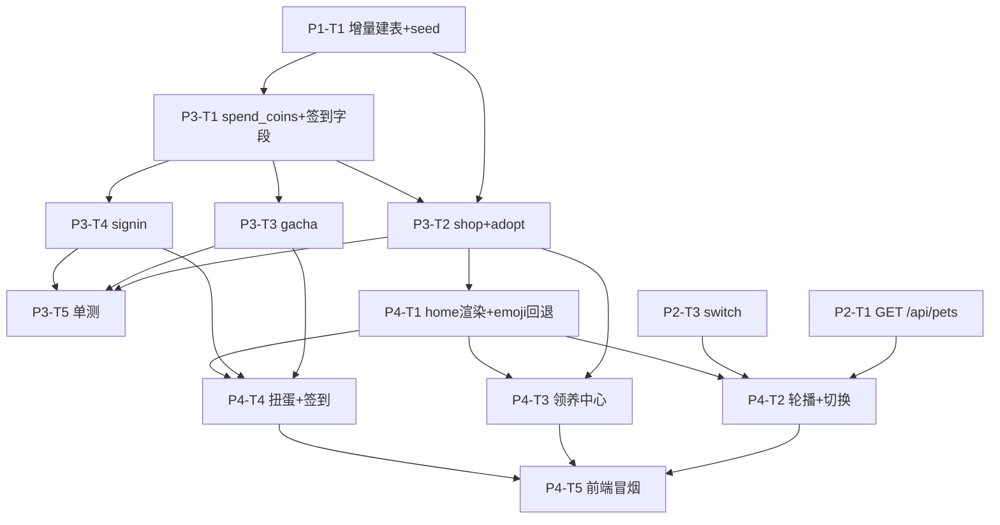
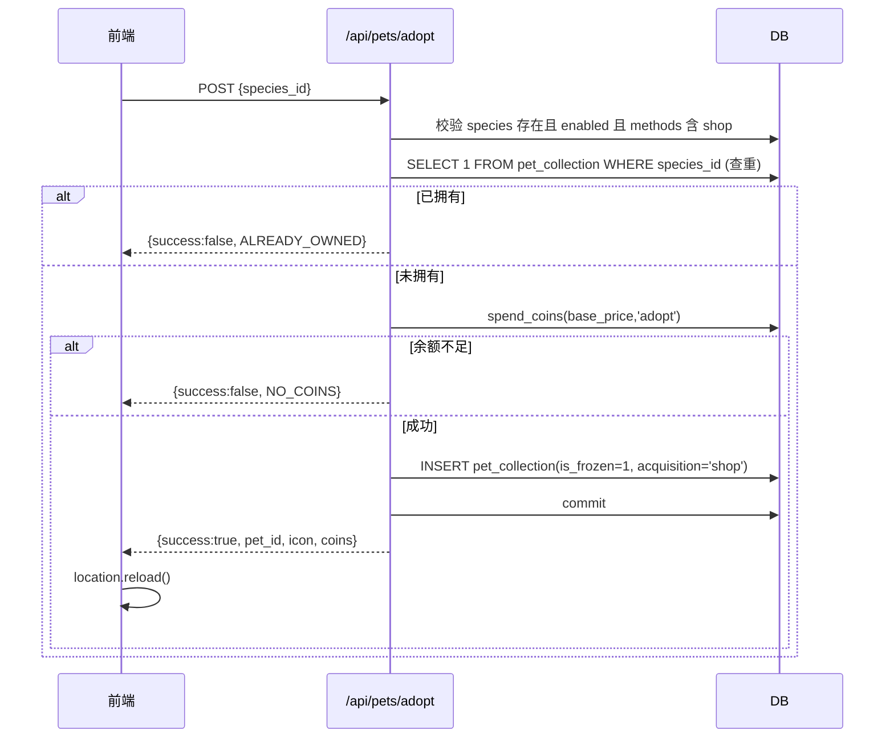
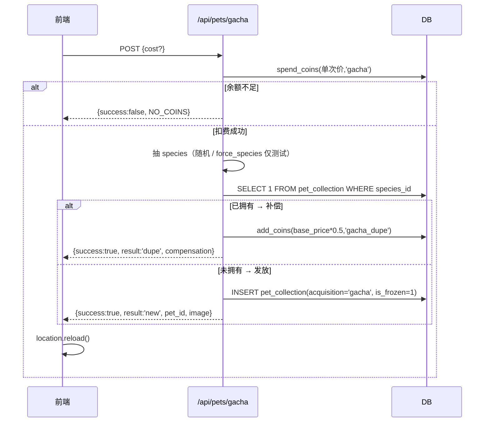
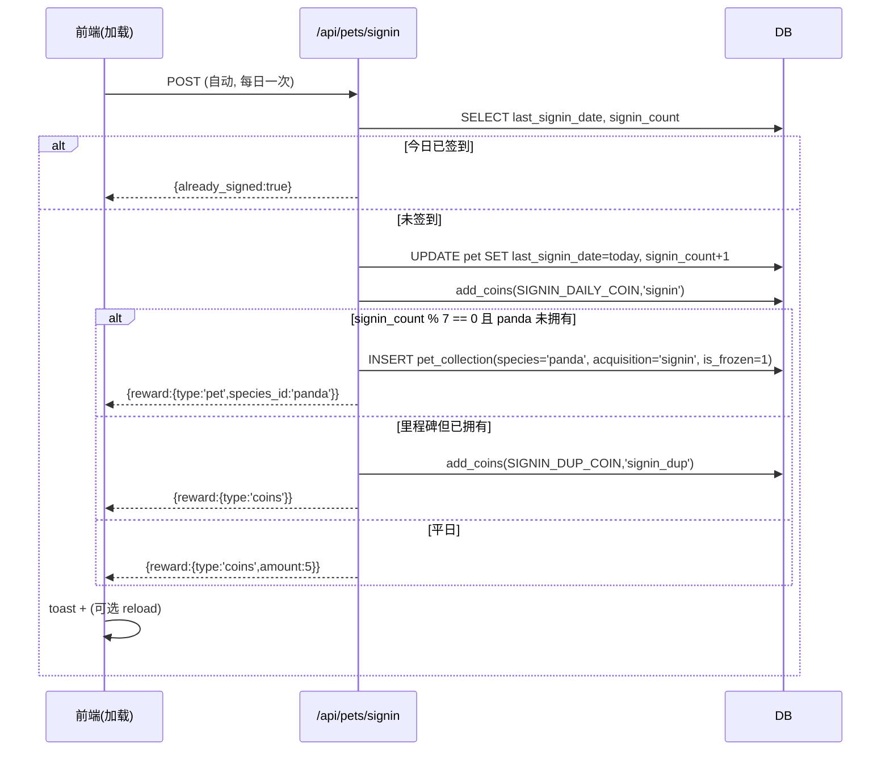

# 作业小龙 v3.3 多宠物系统 — Phase 3（获取系统）+ Phase 4（前端）增量设计

> 作者：架构师 高见远（software-architect）
> 输入：`docs/multi-pet-implementation-plan.md`（Phase 1+2 已落地）、`docs/multi-pet-design.md`（v1.0）、现有 `app/multi_pet.py` / `app/database.py` / `app/main.py` / `app/templates/index.html` 实测
> 目标：**最小增量改动**落地「获取系统（领养/扭蛋/签到）」+「前端多宠物化」，不破坏生产数据，不依赖图片即可运行
> 配套铁律（沿用 Phase 1+2）：测试/开发只在 `HOMEWORK_PET_DB_PATH` 指向的测试库副本跑；`app/homework_pet.db` 只读不碰；所有 schema 变更增量幂等

---

## 0. 实测结论（纠正一个关键误判）

任务书假设「`index.html` 中 50+ 处 `/api/pet` 调用」。经实测 **这是错的**，须先澄清，因为它直接决定了 Phase 4 的体量：

- **「50+ 处 `WHERE id=1`」是后端 `main.py` 的存量**，不是前端的 fetch 调用。
- **前端 `index.html` 实际只有 8 个 `/api/pet*` 端点、9 处调用点**（详见 §B.1）。
- 更关键的是：Phase 1+2 的**镜像兼容层**已保证 `pet` 表(id=1)始终等于「激活宠物」的镜像。因此所有 `/api/pet*`（rename/feed/interact/mood/skins/quiz）以及服务端渲染的中央宠物展示，在**切换宠物后只要 `location.reload()` 一次**就自动正确，**无需逐个改写旧调用**。

→ **Phase 4 的前端工作量比预期小得多**：主要是「新增」多宠物 UI（轮播/切换/领养/扭蛋/签到），而非「改写」旧代码。这就是「最小增量」的杠杆点。

---

# Part A — Phase 3 获取系统（后端）

## A.1 新增/修改 schema 评估

**结论：Phase 3 不需要新表，仅需给 `pet` 表加 2 个全局字段。**

| 是否需要 | 对象 | 说明 |
|---|---|---|
| ❌ 新表 | — | adopt/gacha/signin 的宠物都落 `pet_collection`；gacha 奖池是代码常量，不落库 |
| ✅ 新字段 ×2 | `pet.last_signin_date` (DATE) | 签到防重，每天一次（全局，与 `last_streak_date` 同层） |
| ✅ 新字段 ×1 | `pet.signin_count` (INTEGER DEFAULT 0) | 累计签到次数，用于里程碑发宠（避免依赖 streak 语义） |
| ❌ | `coin_transactions` | 已存在，直接复用（source 用 `'adopt'`/`'gacha'`/`'gacha_dupe'`/`'signin'`/`'signin_dup'`） |
| ❌ | `pet_collection` | Phase 1 已建，获取系统的宠物直接 INSERT，沿用 `is_frozen=1`（非激活，不打断当前宠物） |

### 增量 SQL（幂等，放 `database.py`）

沿用 `init_db()` 现有的「逐个 ALTER + try/except」模式，把两字段并入 `pet` 列清单即可：

```python
# 在 database.py init_db() 的 pet 列循环中，现有清单末尾追加：
for col, default in [
    ('last_streak_date', None),
    ('math_streak', 0),
    ('last_math_date', None),
    ('bond', 50),
    ('coins', 0),
    ('last_decay_date', None),
    ('math_challenge_today', 0),
    ('last_signin_date', None),   # ← Phase 3 新增：签到防重
    ('signin_count', 0),          # ← Phase 3 新增：累计签到次数
]:
    try:
        if default is not None:
            cursor.execute(f"ALTER TABLE pet ADD COLUMN {col} INTEGER DEFAULT {default}")
        else:
            cursor.execute(f"ALTER TABLE pet ADD COLUMN {col} DATE")
    except Exception:
        pass
```

> 说明：不新建任何表，不 DROP/DELETE；`pet_collection` 与 `species_catalog` 由 Phase 1 已建，本阶段只读/INSERT。

---

## A.2 通用消费函数 `spend_coins`（核心新增）

`add_coins()`（main.py:260）对负金额会 `max(0, coins+amount)` **静默截断到 0**，不适合「余额不足应拒绝」的领养/扭蛋。因此新增对称函数 `spend_coins()`，余额不足返回 `False`（不扣），与 `add_coins` 共用 `coin_transactions` 流水。

```python
def spend_coins(conn, amount, source, description=""):
    """扣龙币（全局钱包）。余额不足返回 False（不扣、不写流水）；成功返回新余额。

    与 add_coins 对称：validate → 写 coin_transactions(type='spend') → UPDATE pet.coins。
    仅用于 adopt/gacha 等"必须先校验余额"的场景。
    """
    if amount <= 0:
        return conn.execute("SELECT coins FROM pet WHERE id=1").fetchone()['coins']
    pet = conn.execute("SELECT coins FROM pet WHERE id=1").fetchone()
    if not pet or pet['coins'] < amount:
        return False
    new_balance = pet['coins'] - amount
    conn.execute(
        "INSERT INTO coin_transactions (type, source, amount, balance_after, description) VALUES (?,?,?,?,?)",
        ('spend', source, -amount, new_balance, description))
    conn.execute("UPDATE pet SET coins = ? WHERE id=1", (new_balance,))
    return new_balance
```

**一致性约定**：
- `add_coins(conn, +n, 'xxx')` 正向加（含周末双倍逻辑），新余额由函数内部 `max(0,...)` 兜底。
- `spend_coins(conn, n, 'xxx')` 反向扣，余额不足直接拒绝（**不**静默清零）。
- 二者都写 `coin_transactions`，`balance_after` 始终等于扣/加后真实余额 → 流水可对账。
- 调 `spend_coins` 后若后续业务 INSERT 失败需 `conn.rollback()`（扭蛋/领养逻辑用 try/except 包裹）。

---

## A.3 领养商店 adopt

- **API**：`POST /api/pets/adopt {species_id: str}`
- **校验顺序**：物种存在且 `enabled=1` → 该物种 `acquisition_methods` 含 `'shop'`（只能领养 shop 途径物种）→ 查重（同物种限 1 只）→ 余额 ≥ `base_price` → 扣币 → INSERT。

```python
@app.post("/api/pets/adopt")
async def adopt_pet(species_id: str = Form(...)):
    conn = get_db_connection()
    sp = conn.execute(
        "SELECT * FROM species_catalog WHERE id=? AND enabled=1", (species_id,)).fetchone()
    if not sp:
        conn.close(); return {"success": False, "code": "NO_SPECIES", "message": "物种不存在或未上架"}
    methods = (sp['acquisition_methods'] or '').split(',')
    if 'shop' not in methods:
        conn.close(); return {"success": False, "code": "NOT_SHOP", "message": f"{sp['name']}不可通过商店领养"}

    # 同物种限 1 只（已确认决策）
    if conn.execute("SELECT 1 FROM pet_collection WHERE species_id=?", (species_id,)).fetchone():
        conn.close()
        return {"success": False, "code": "ALREADY_OWNED",
                "message": f"你已经拥有{sp['name']}啦（同物种限 1 只）"}

    price = sp['base_price']
    new_balance = spend_coins(conn, price, 'adopt', f'领养{sp["name"]}')
    if new_balance is False:
        conn.close()
        return {"success": False, "code": "NO_COINS", "message": f"龙币不足，需要{price}龙币"}

    try:
        cur = conn.execute("""
            INSERT INTO pet_collection
                (species_id, skin_id, name, exp, hunger, mood, bond, status, acquisition, is_frozen)
            VALUES (?, 'default', ?, 0, 80, 80, 50, 'happy', 'shop', 1)
        """, (species_id, sp['name']))          # 昵称默认用物种名，玩家可后续改名
        new_id = cur.lastrowid
        conn.commit()
    except Exception:
        conn.rollback(); conn.close()
        return {"success": False, "code": "ERR", "message": "领养失败，请重试"}
    conn.close()
    return {"success": True, "pet_id": new_id, "species_id": species_id,
            "name": sp['name'], "icon": sp['icon'],
            "image": f"/static/species/{species_id}/stage-0.png",
            "message": f"成功领养{sp['name']}！", "coins": new_balance}
```

> 领取的宠物 `is_frozen=1`（非激活），不打断当前激活宠物；玩家可在轮播里点选切换。

---

## A.4 扭蛋机 gacha

- **API**：`POST /api/pets/gacha {cost?: int}`（默认单次价，推荐 `50`）
- **奖池来源**：`acquisition_methods` 含 `'gacha'` 的物种 → `rabbit`(150,rare) / `fox`(300,epic) / `unicorn`(500,legend)（由 `species_catalog` 数据驱动，不硬编码）。
- **重复抽中**：已拥有 → 转龙币补偿 `floor(base_price * 0.5)`，来源 `'gacha_dupe'`，**不**再发宠物。
- **可测性**：支持测试钩子 `force_species`（仅当 `MULTI_PET_TEST=1` 环境变量时生效），否则 `random.choices` 按权重抽。

```python
# 奖池权重（代码常量，可按 species_catalog 动态计算；这里给推荐默认）
GACHA_POOL = {'rabbit': 0.50, 'fox': 0.30, 'unicorn': 0.20}
GACHA_SINGLE_COST = int(os.environ.get("GACHA_COST", "50"))   # 可配置
GACHA_DUPE_RATE = 0.50                                        # 重复补偿比例

@app.post("/api/pets/gacha")
async def gacha(cost: int = Form(None), force_species: str = Form(None)):
    single = cost if (cost and cost > 0) else GACHA_SINGLE_COST
    conn = get_db_connection()
    new_balance = spend_coins(conn, single, 'gacha', f'扭蛋×1({single})')
    if new_balance is False:
        conn.close(); return {"success": False, "code": "NO_COINS", "message": f"龙币不足，需要{single}龙币"}

    # 1) 抽物种
    if os.environ.get("MULTI_PET_TEST") == "1" and force_species in GACHA_POOL:
        species_id = force_species
    else:
        species_ids = list(GACHA_POOL.keys())
        weights = [GACHA_POOL[k] for k in species_ids]
        species_id = random.choices(species_ids, weights=weights, k=1)[0]

    sp = conn.execute("SELECT * FROM species_catalog WHERE id=?", (species_id,)).fetchone()

    # 2) 重复 → 龙币补偿
    if conn.execute("SELECT 1 FROM pet_collection WHERE species_id=?", (species_id,)).fetchone():
        comp = int(sp['base_price'] * GACHA_DUPE_RATE)
        add_coins(conn, comp, 'gacha_dupe', f'扭蛋重复:{sp["name"]}')
        conn.commit(); conn.close()
        return {"success": True, "result": "dupe", "species_id": species_id,
                "compensation": comp, "icon": sp['icon'],
                "message": f"{sp['name']}已拥有，转化为{comp}龙币补偿",
                "coins": conn and new_balance + comp}   # 注：下方统一读余额

    # 3) 新物种 → 发放（冻结态）
    try:
        cur = conn.execute("""
            INSERT INTO pet_collection
                (species_id, skin_id, name, exp, hunger, mood, bond, status, acquisition, is_frozen)
            VALUES (?, 'default', ?, 0, 80, 80, 50, 'happy', 'gacha', 1)
        """, (species_id, sp['name']))
        new_id = cur.lastrowid
        conn.commit()
    except Exception:
        conn.rollback(); conn.close()
        return {"success": False, "code": "ERR", "message": "扭蛋失败，请重试"}
    coins_now = conn.execute("SELECT coins FROM pet WHERE id=1").fetchone()['coins']
    conn.close()
    return {"success": True, "result": "new", "species_id": species_id, "pet_id": new_id,
            "name": sp['name'], "icon": sp['icon'],
            "image": f"/static/species/{species_id}/stage-0.png",
            "message": f"抽中{sp['name']}！", "coins": coins_now}
```

> 伪代码修正点：抽中新物种后 `coins` 应回读 `pet.coins`（已扣 gacha 费、未加补偿），上面 `dupe` 分支的 `coins` 同理应以回读为准（示例里 `conn and ...` 仅示意，实现时统一 `SELECT coins`）。

---

## A.5 签到发宠 signin

- **API**：`POST /api/pets/signin`（幂等，每天一次；前端可在页面加载时调用，服务端强制防重）
- **防重**：`pet.last_signin_date == today` → 直接返回 `already_signed`，不重复发奖。
- **奖励规则（推荐默认，均可配置）**：
  - 每日基础奖励：`SIGNIN_DAILY_COIN = 5` 龙币（来源 `'signin'`，鼓励每日打开）。
  - 里程碑（每 `SIGNIN_PANDA_INTERVAL = 7` 次签到）且 **panda 未拥有** → 发熊猫（`acquisition='signin'`，冻结）。
  - 里程碑但 **panda 已拥有** → 给 `SIGNIN_DUP_COIN = 30` 龙币补偿（来源 `'signin_dup'`）。

```python
SIGNIN_DAILY_COIN = int(os.environ.get("SIGNIN_DAILY_COIN", "5"))
SIGNIN_PANDA_INTERVAL = int(os.environ.get("SIGNIN_PANDA_INTERVAL", "7"))
SIGNIN_DUP_COIN = int(os.environ.get("SIGNIN_DUP_COIN", "30"))

@app.post("/api/pets/signin")
async def daily_signin():
    conn = get_db_connection()
    pet = conn.execute("SELECT last_signin_date, signin_count, coins FROM pet WHERE id=1").fetchone()
    today = get_current_time().strftime('%Y-%m-%d')
    if pet['last_signin_date'] == today:
        conn.close()
        return {"success": True, "already_signed": True, "message": "今天已经签到啦"}

    new_count = (pet['signin_count'] or 0) + 1
    conn.execute("UPDATE pet SET last_signin_date=?, signin_count=? WHERE id=1",
                 (today, new_count))

    reward = {"type": "coins", "amount": SIGNIN_DAILY_COIN}
    add_coins(conn, SIGNIN_DAILY_COIN, 'signin', '每日签到')

    # 里程碑发宠
    if new_count % SIGNIN_PANDA_INTERVAL == 0:
        if not conn.execute("SELECT 1 FROM pet_collection WHERE species_id='panda'").fetchone():
            sp = conn.execute("SELECT * FROM species_catalog WHERE id='panda'").fetchone()
            cur = conn.execute("""
                INSERT INTO pet_collection
                    (species_id, skin_id, name, exp, hunger, mood, bond, status, acquisition, is_frozen)
                VALUES ('panda', 'default', ?, 0, 80, 80, 50, 'happy', 'signin', 1)
            """, (sp['name'],))
            reward = {"type": "pet", "species_id": "panda", "pet_id": cur.lastrowid,
                      "icon": sp['icon'], "name": sp['name']}
        else:
            add_coins(conn, SIGNIN_DUP_COIN, 'signin_dup', '签到里程碑(熊猫已拥有)')
            reward = {"type": "coins", "amount": SIGNIN_DAILY_COIN + SIGNIN_DUP_COIN}

    conn.commit()
    coins_now = conn.execute("SELECT coins FROM pet WHERE id=1").fetchone()['coins']
    conn.close()
    return {"success": True, "already_signed": False, "signin_count": new_count,
            "reward": reward, "coins": coins_now,
            "message": "签到成功！" + ("获得熊猫🐼" if reward['type'] == 'pet' else "")}
```

---

## A.6 商店/目录 API

- **`GET /api/pets/shop`**：返回可领养（shop 途径）物种列表，供前端领养中心渲染。前端需显示「是否已拥有」以便禁用按钮（同物种限 1 只）。

```python
@app.get("/api/pets/shop")
async def get_adopt_shop():
    conn = get_db_connection()
    rows = conn.execute(
        "SELECT * FROM species_catalog WHERE enabled=1 AND acquisition_methods LIKE '%shop%' ORDER BY sort_order"
    ).fetchall()
    owned = {r['species_id'] for r in conn.execute("SELECT species_id FROM pet_collection").fetchall()}
    conn.close()
    items = []
    for r in rows:
        d = dict(r)
        items.append({
            'id': d['id'], 'name': d['name'], 'icon': d['icon'],
            'desc': d.get('desc', ''), 'base_price': d.get('base_price', 0),
            'rarity': d.get('rarity', 'common'),
            'image': f"/static/species/{d['id']}/stage-0.png",
            'owned': d['id'] in owned,
        })
    return {"shop": items}
```

> `GET /api/pets/species`（Phase 2 已有）保留给「物种图鉴」；`GET /api/pets/shop` 是它的 shop 子集 + owned 标记。

---

## A.7 Phase 3 任务清单（P3-T1 ~ P3-T5）

| Task ID | 任务目标 | 涉及文件 | 增量 schema / 关键改动 | 验收标准 | 依赖 |
|---|---|---|---|---|---|
| **P3-T1** | `spend_coins` + 签到字段 | `app/main.py`（新增 `spend_coins` 紧邻 `add_coins`）、`app/database.py`（pet 加 `last_signin_date`/`signin_count`） | 2 字段增量 ALTER（幂等）；新函数 `spend_coins(conn,amount,source,desc)` 余额不足返回 `False` | 测试库：`spend_coins` 扣费成功返回新余额；余额不足返回 `False` 且不写流水；`pet` 两字段存在且默认 0/NULL | P1-T1 |
| **P3-T2** | `GET /api/pets/shop` + `POST /api/pets/adopt` | `app/main.py` | 无新表；用 `spend_coins` + 同物种查重 | ①商店返回 cat/rabbit/panda（含 owned 标记）②领养扣 base_price 并 INSERT 冻结宠物 ③同物种二次领养返回 `ALREADY_OWNED` ④余额不足返回 `NO_COINS` 且不插入 | P3-T1 |
| **P3-T3** | `POST /api/pets/gacha` | `app/main.py`（`GACHA_POOL`/`GACHA_SINGLE_COST` 常量） | 无 schema；重复转龙币补偿 | ①扣 50 龙币 ②新物种 INSERT 冻结宠物 ③重复抽中返回 `dupe`+补偿且龙币净增补偿额 ④`force_species` 仅在 `MULTI_PET_TEST=1` 生效 | P3-T1 |
| **P3-T4** | `POST /api/pets/signin` | `app/main.py` | 依赖 P3-T1 的 `last_signin_date`/`signin_count` | ①同日重复调用返回 `already_signed` ②每 7 次发熊猫（未拥有）③已拥有则给 `signin_dup` 龙币 ④每日基础 +5 龙币 | P3-T1 |
| **P3-T5** | Phase 3 单测（gacha 可测性 + 货币一致性） | `app/tests/test_phase3_acquire.py`（新建）或并入现有测试 | 仅测试代码 | ①`MULTI_PET_TEST=1` + `force_species` 可确定性抽中并断言补偿/发放 ②`spend_coins` 与 `add_coins` 流水 `balance_after` 连续可对账 ③领养/扭蛋失败路径 `rollback` 不残留脏数据 | P3-T2,P3-T3,P3-T4 |

### A.7.1 gacha 可测性方案（应对风险）

| 风险 | 对策 |
|---|---|
| 随机性难测 | ①常量 `GACHA_POOL` 权重固定；②测试设 `MULTI_PET_TEST=1` 并可传 `force_species=rabbit` 强制抽中；③单元测试对「已拥有 rabbit」断言走 `dupe` 分支，对「未拥有」断言走 `new` 分支。生产环境 `force_species` 被忽略，纯随机。 |
| `spend_coins`/`add_coins` 不一致 | 统一经 `coin_transactions`；测试断言：领养后 `SUM(amount)` 轨迹与 `pet.coins` 一致；`dupe` 后余额 = 扣费后 + 补偿。 |
| 并发重复扣费 | 单用户单线程场景（家庭作业 App），暂不加锁；`spend_coins` 内 `SELECT coins` 与 `UPDATE` 同连接同事务，足够。 |

---

# Part B — Phase 4 前端改造

## B.1 现状盘点（实测，`/api/pet*` 调用点全表）

> 经 grep `index.html` 实测，**仅 8 个端点、9 处调用点**（非任务书担心的 50+）。「50+」是后端 `main.py` 的 `WHERE id=1` 存量。

| # | 行号 | 端点 | 用途 | 改造需求 |
|---|---|---|---|---|
| 1 | 1917 | `POST /api/pet/rename` | 改名 | 不变（作用于激活宠物，镜像生效） |
| 2 | 1933 | `POST /api/pet/math-quiz` | 出题 | 不变 |
| 3 | 1965 | `POST /api/pet/math-quiz/answer` | 答题 | 不变 |
| 4 | 1997 | `GET /api/pet/skins` | 加载皮肤面板 | 不变；但渲染需按「当前激活宠物」个体（已在后端按 `active_id` 取，无需前端改） |
| 5 | 2023 | `POST /api/pet/skin/select` | 选皮肤 | 不变；写入 `pet_collection.skin_id`（后端已个体化） |
| 6 | 2034 | `POST /api/pet/skin/unlock` | 解锁皮肤 | 不变 |
| 7 | 2047 | `GET /api/pet/skins` | 解锁后刷新 | 不变 |
| 8 | 2076 | `GET /api/pet/mood` | 心情轮询 | 不变（读激活宠物镜像） |
| 9 | 3181 | `GET /api/pet/mood` | 调度后轮询 | 不变 |

**服务端渲染**（`home()` 直出，无 fetch）：中央宠物头像在第 1391–1424 行，`` + 昵称/状态。这是**唯一需要适配的渲染点**（多物种图片 + emoji 回退），见 B.3 / P4-T1。

**关键结论**：Phase 4 不需要改写上面 9 处旧调用。切换/领养/扭蛋/签到后统一 `location.reload()`，服务端用镜像重渲染，旧功能零改动即正确。

---

## B.2 多宠物 UI 方案（全部为「新增」，不侵入旧逻辑）

| UI 模块 | 调用 API | 行为 |
|---|---|---|
| **顶部宠物卡片轮播** | `GET /api/pets` | 横向卡片列出全部 `pet_collection`（头像/昵称/Lv/激活高亮）；点非激活卡片 → 弹确认 → `POST /api/pets/switch` → `reload()` |
| **切换弹窗** | `POST /api/pets/switch` | 同上；成功后 `location.reload()` |
| **领养中心弹窗** | `GET /api/pets/shop` + `POST /api/pets/adopt` | 展示 shop 物种（价/稀有度/emoji），`owned` 的禁用「领养」；点击领养 → 成功 toast → `reload()` |
| **扭蛋机弹窗** | `POST /api/pets/gacha` | 显示当前龙币、单抽价；点击「扭蛋」→ 动画（emoji 🎁 翻转）→ 展示结果（新宠物 / 龙币补偿）→ `reload()` |
| **签到按钮 / 自动签到** | `POST /api/pets/signin` | 页面加载时静默调用一次（服务端防重）；若返回 `reward.type=='pet'` 弹「获得熊猫🐼」 |
| **物种图鉴** | `GET /api/pets/species` | 展示 7 物种介绍（可选，低优先） |
| **进化/状态/互动/喂食绑定激活宠物** | （旧 `/api/pet*`，不动） | 靠镜像层 + `reload()` 自动正确 |
| **皮肤个体化** | `GET/POST /api/pet/skins`、`/skin/select` | 后端已按激活宠物取/写 `skin_id`；前端无需改，切换后 `reload()` 即跟随 |
| **图片** | `` | `onerror` 回退 emoji（见 B.3） |

---

## B.3 图片与 emoji 回退（解耦关键）

中央头像渲染改造（最小改动，保留龙现有 dragon-skins 体验）：

- **`home()`（main.py）**：取激活宠物的 `species_id`（经 `get_active_pet_id` → `pet_collection.species_id`）。
  - 若 `species_id == 'dragon'`：沿用现有 `get_skin_stage_image_path(current_skin_id, stage)`（龙现有美图不动）。
  - 否则：`species_image = f"/static/species/{species_id}/stage-{stage}.png"`，`species_icon = sp['icon']`（emoji）。
  - 模板新增变量：`species_image`、`species_icon`、`species_id`。
- **`index.html` 头像区**：

```html
<div class="pet-avatar" id="petAvatar">
  <div class="mood-bubble" id="moodBubble" style="display:none;"></div>
  <!-- emoji 兜底层（图片 404 时显示） -->
  <span class="emoji-fallback" id="emojiFallback"
        style="position:absolute;inset:0;display:flex;align-items:center;justify-content:center;
               font-size:96px;">{{ species_icon }}</span>
  <div class="dragon-svg-wrap dragon-stage-{{ appearance.stage }}">
    
  </div>
  ...（encourage 气泡等保持不变）
</div>
```

> 该模式保证：**图片不存在（Phase 5 未生成）时直接显示 emoji，前端不崩、无 404 白屏**。Phase 5 图片并行生成后，把 PNG 落到 `app/static/species/{id}/stage-{0..4}.png` 即自动生效，无需改前端。

---

## B.4 具体 edit 清单（按 `index.html` 区块）

| 位置（函数/行特征） | 现状 | 改造后 | 新 API |
|---|---|---|---|
| `home()` 渲染（main.py ~498–508） | `skin_stage_image` 只对龙；`pet_dict` 为镜像 | 计算 `species_id`/`species_image`/`species_icon`；龙走原路径，其余走 species 路径；传入模板 | — |
| 头像区（index.html 1391–1398） | `` + dragon 兜底 | 新增 `#emojiFallback` 层；`` `onerror` 隐藏并显示 emoji | — |
| 顶部新增轮播容器（建议在宠物中央区上方，~1389 前插入） | 无 | `<div class="pet-carousel" id="petCarousel">…</div>` + 左右按钮；JS 拉 `GET /api/pets` 渲染卡片 | `GET /api/pets` |
| 底部新增入口按钮（互动按钮区或独立栏） | 无 | 🛒领养中心 / 🎰扭蛋机 / 🔄切换 / 📅签到 四个入口 | — |
| 切换弹窗 + `showSwitchModal()`（新增 `<script>`） | 无 | 拉 `/api/pets` → 渲染卡片 → 点非激活卡片 `POST /api/pets/switch` → `reload()` | `GET /api/pets`, `POST /api/pets/switch` |
| 领养中心 `showAdoptShop()` | 无 | 拉 `GET /api/pets/shop` → 渲染 shop 卡片（价/稀有度/owned）→ 点领养 `POST /api/pets/adopt` → toast + `reload()` | `GET /api/pets/shop`, `POST /api/pets/adopt` |
| 扭蛋机 `showGachaPanel()` | 无 | 显示龙币/单抽价 → 点扭蛋 `POST /api/pets/gacha`（动画）→ 展示新宠物或补偿 → `reload()` | `POST /api/pets/gacha` |
| 签到 `autoSignin()` | 无 | `DOMContentLoaded` 后静默 `POST /api/pets/signin` 一次；若 `reward.type=='pet'` 弹 toast | `POST /api/pets/signin` |
| 旧 `updateMoodDisplay`（2074） | 轮询 `/api/pet/mood` | **不改**；切换后 `reload()` 自动指向新激活宠物镜像 | （旧） |

> 所有「切换/领养/扭蛋/签到」成功后统一 `location.reload()` —— 这是把 Phase 4 工作量压到最小的核心技巧，且保证旧功能 100% 不崩。

---

## B.5 Phase 4 任务清单（P4-T1 ~ P4-T5）

| Task ID | 任务目标 | 涉及文件 | 关键改动 | 验收标准 | 依赖 |
|---|---|---|---|---|---|
| **P4-T1** | `home()` 多宠物渲染 + emoji 回退 + 静态目录占位 | `app/main.py`（home 计算 species_image/icon）、`app/templates/index.html`（头像区 + `#emojiFallback`）、`app/static/species/.gitkeep`（建目录占位） | 龙走原路径，其余走 species 路径；模板新增 `species_image`/`species_icon`/`species_id` | 切到猫/兔等物种时显示 emoji（图片未生成）；切回龙显示原龙图；无 404 白屏 | P3-T2（shop 数据） |
| **P4-T2** | 宠物卡片轮播 + 切换弹窗 | `app/templates/index.html` | 新增轮播容器 + `showSwitchModal()` 拉 `GET /api/pets`、`POST /api/pets/switch` | 卡片列出全部宠物、激活高亮；点非激活卡片切换成功并刷新；`location.reload()` 后中央宠物更新 | P2-T1,P2-T3 |
| **P4-T3** | 领养中心 | `app/templates/index.html` | `showAdoptShop()` 拉 `GET /api/pets/shop` + `POST /api/pets/adopt` | 展示 shop 物种（价/稀有度）；owned 禁用；领养成功 toast + 龙币扣减；重复领养提示已拥有 | P3-T2 |
| **P4-T4** | 扭蛋机 UI + 签到 | `app/templates/index.html` | `showGachaPanel()` 拉 `POST /api/pets/gacha`；`autoSignin()` 拉 `POST /api/pets/signin` | 扭蛋展示新宠物/补偿；签到每日一次、里程碑弹熊猫；均无图片也能跑 | P3-T3,P3-T4 |
| **P4-T5** | 前端冒烟 + 图片回退验证 + 旧功能回归 | `app/templates/index.html`（验证）、手动 checklist | 不新增代码，仅验收 | ①能切换宠物 ②能领养 ③能扭蛋 ④图片 404 → emoji 正常 ⑤旧功能（喂食/互动/改名/皮肤/算术题/心情轮询）不崩 | P4-T1~T4 |

### B.5.1 与图片解耦说明（明确）

- 前端**不依赖图片存在**即可运行：所有宠物头像 `` 均带 `onerror` → emoji 兜底。
- Phase 5（AI 生图）与 Phase 4 **完全并行、互不阻塞**：图片只是落到 `app/static/species/{id}/stage-{0..4}.png` 的静态资源，前端无需改代码即自动生效。
- 因此 Phase 4 可先于 Phase 5 完成验收；Phase 5 不计入 Phase 4 的依赖。

---

# Part C — 共享约定 & 待明确

## C.1 跨 Phase 3/4 约定（工程师必读）

1. **龙币全局、单一来源**：`add_coins`(加) / `spend_coins`(扣，余额不足拒) 都只动 `pet.coins`(id=1) 并写 `coin_transactions`。获取系统一律走 `spend_coins`，成就/签到补偿走 `add_coins`。
2. **查重函数复用**：adopt / gacha / signin / 成就发宠 前统一 `SELECT 1 FROM pet_collection WHERE species_id=?` —— **同物种限 1 只**（已确认决策）。
3. **新宠物一律 `is_frozen=1`**：adopt/gacha/signin/成就发放的宠物均为冻结态，不打断当前激活宠物；玩家在轮播里主动切换才激活。
4. **gacha 奖池来源**：动态取 `acquisition_methods LIKE '%gacha%'` → rabbit/fox/unicorn；权重 `GACHA_POOL` 常量。新增 gacha 物种只需在 `species_catalog` 标 `gacha` 并更新常量。
5. **切换/获取后统一 `location.reload()`**：前端靠镜像层重渲染，旧 `/api/pet*` 调用零改动即正确。
6. **图片解耦**：路径固定 `/static/species/{id}/stage-{n}.png`，前端 emoji 兜底；后端返回 `image` 字段供前端预填。
7. **测试库铁律**：所有 Phase 3 实现与测试只在 `HOMEWORK_PET_DB_PATH` 指向的测试库副本跑；`app/homework_pet.db` 不碰。
8. **gacha 可测性**：生产随机；测试设 `MULTI_PET_TEST=1` 允许 `force_species` 强制抽中。

## C.2 待明确事项（已给推荐默认值，均可配置）

| 项 | 推荐默认值 | 配置方式 | 备注 |
|---|---|---|---|
| 扭蛋单次价 | `50` 龙币 | 环境变量 `GACHA_COST` / 或 `parent_settings.gacha_cost` | 设计文档原写 100，本方案降为 50 更友好 |
| 扭蛋重复补偿比例 | `0.5`（50%） | 常量 `GACHA_DUPE_RATE` | 已确认「50% 价值」 |
| 签到每日基础龙币 | `5` | `SIGNIN_DAILY_COIN` | 鼓励每日打开 |
| 签到发熊猫间隔 | 每 `7` 次 | `SIGNIN_PANDA_INTERVAL` | 里程碑式，确定可测 |
| 签到熊猫已拥有的补偿 | `30` 龙币 | `SIGNIN_DUP_COIN` | — |
| 领养上限 | 受「同物种限 1 只」约束，实际 ≤7 | — | 不需要额外总数上限 |
| 放生 | 第一版不做 | — | 已确认 |

> 以上数值若产品想调，改常量/环境变量即可，无需动表结构。

---

## C.3 任务依赖图（Phase 3 → Phase 4）



## C.4 关键流程图（Mermaid 时序）

### 领养 adopt


### 扭蛋 gacha


### 签到 signin


---

## 附：落地顺序建议（给工程师）

1. **Phase 3 先**（后端，测试库）：P3-T1 → P3-T2 → P3-T3 → P3-T4 → P3-T5（单测）。
2. 手测：领养扣费/查重、扭蛋抽中/补偿（`MULTI_PET_TEST=1` 强制）、签到里程碑发熊猫、龙币流水对账。
3. **Phase 4 后**（前端）：P4-T1（home 渲染+emoji）→ P4-T2（轮播+切换）→ P4-T3（领养中心）→ P4-T4（扭蛋+签到）→ P4-T5（冒烟）。
4. 全程不依赖图片；Phase 5 图片生成可并行，落盘即生效。

**方案版本**：Phase 3+4 增量设计 v1.0
**适用范围**：Phase 3（获取系统后端）+ Phase 4（前端多宠物化）
**铁律**：生产库只读；测试库经 `HOMEWORK_PET_DB_PATH`；增量幂等；图片解耦。
